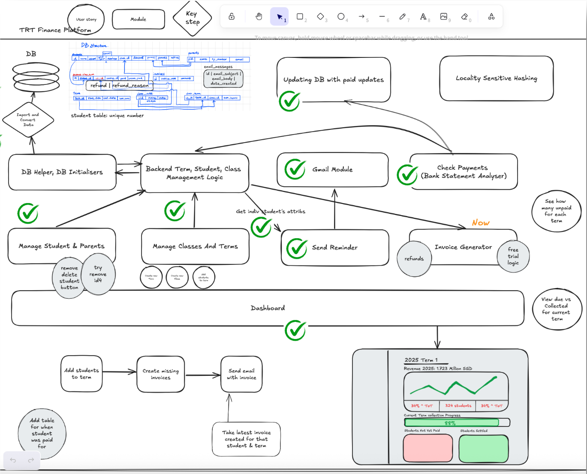

# TRT-Finance-Platform
[](https://wakatime.com/badge/user/018cc5a8-3c44-4f51-a6f0-5021ac41b5e1/project/f7854c92-64d6-42eb-9de2-b1109c3e0445)

A commissioned project for my ex-tuition teacher, built with gratitude for his dedication to his students.


## Problem
My ex-tuition teacher had to regularly chase after parents who had not paid their tuition fees. 
Often, even when payment is made, he would have to download his bank statements and manually cross-reference the payments with his list of students, sometimes without names, invoice numbers nor parents' names.

Invoice has to also be manually generated and emailed to the parents each term,

This was a time-consuming and frustrating process, and he wanted a way to automate it.


## How to use (with docker)
1. Install docker
1. Clone this repository
1. cd into the repository with command prompt
1. Build the docker image
```
docker build -t trt-finance .
```
1. Run the docker image
```
docker run -p 8051:8051 trt-finance
```
1. Open your browser and go to `http://localhost:8051/`
1. Enjoy!

## Shutting down
1. Go to command line and type `docker ps`
1. Find the container id or name of the trt-finance container
1. Type `docker stop <container_id or name>`


## User Stories

### Core User Stories
1. **Student Management**: Mr Wong adds students and their details, like the class that they belong in.
2. **Class Assignment**: Mr Wong can add students to his class (assumes a student can only be in one class at a time).
3. **Parent Management**: Add new parents to the system with their contact details, then assign parents to students by ID or select existing parents by name.

### Extended User Stories
4. **Invoice Generation**: Generate invoices for students each term and email them to parents automatically.
5. **Payment Tracking**: Upload bank statements and automatically match payments to students to track who has paid.
6. **Payment Status Management**: View all students in a term, categorized as paid and unpaid.
7. **Payment Reminders**: Send reminder emails to all unpaid students.
8. **Term and Class Management**: Create and manage academic terms and classes with different rates.
9. **Email Communication**: Customize and send emails to parents with invoice attachments.
10. **Payment Analysis**: Analyze bank statements to cross-reference payments with student records.

## Tech Stack

### Tech Architecture


### Backend & Database
- **Python**: Core backend logic and processing 
- **SQLite**: Database management 
- **Relational Database Schema**


### Frontend & UI
- **Streamlit**: Web application framework for the user interface
- **Plotly Express**: Data and graph visualization

### Document Generation
- **LaTeX**: Invoice generation (uses MacTeX)
- **PDF Generation**: For creating invoice documents

### Authentication & Security
- **Streamlit Authenticator**: User authentication system
- **YAML**: Configuration file management

### Email & Communication
- **Gmail API**: Email sending functionality through Google's API
- **Google OAuth2**: Authentication for Gmail integration

### Data Processing
- **Pandas**: Data manipulation and analysis
- **CSV Processing**: Bank statement analysis

### Development & Deployment
- **Docker**: Containerization for deployment
- **Pytest**: Testing framework
- **Git**: Version control
<!-- 
### AI/ML Features
- **NVIDIA API**: AI-powered chatbot (TRT-GPT)
- **LangChain**: Conversational AI framework
- **Meta Llama 3.1**: Language model for the AI assistant
 -->

## Dev notes

# Install LaTeX (MacTeX)
brew install --cask mactex-no-gui

# Install Python packages
pip install codecs subprocess

todo: see total sum to be collected for this term.


Use of session state:
authenticator
pulled_data is a dict, with keys being 'most_recent_term'


When installing Oracle, put instantclient in /config folder. Then `export DYLD_LIBRARY_PATH=/Users/ethanyuxin/Documents/World/TRT-Finance-Platform/config/instantclient_23_3:$DYLD_LIBRARY_PATH`


Term naming convention: 'Y24T3' for Year 2024, Term 3

# Problems
- [ ] How to handle deletion of a particular class in db, but there are still students in that class? Soln: Set the class_id in the student table to NULL?


## Testing
Commands to run to test
```
    export PYTHONPATH=$(pwd)
    pytest test/test_manage_term_and_class.py
```


## Flows/Edge Cases:
Invoice Generation page flow:
> Add students to term
> Show exisiting students in term
> Generate invoice for term
> Email invoice to parents

Check Payments page flow:
> Allow user to upload bank statement if want. 
> Show all students in term, paid and unpaid
> show all unpaid students
> can click send reminder email to all unpaid students


What if students join after start of term? not 12 classes for him. > Right now manually refunding. 
